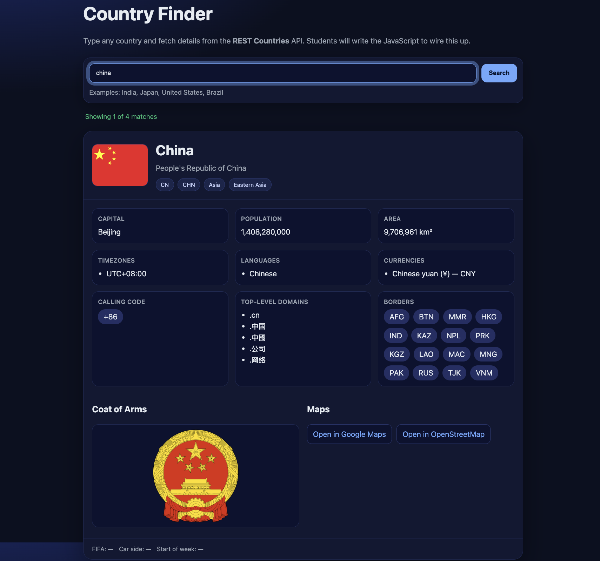

# Country Finder

A simple JavaScript application that allows users to search for any country and view detailed information dynamically using the REST Countries API.

## Live Demo
``

```
## Screenshot


```


## Features

- Search for any country
- Fetches real-time country data from the REST Countries API
- Displays detailed information including:
  - Flag
  - Official and common names
  - Region and subregion
  - Capital
  - Population
  - Area
  - Timezones
  - Languages
  - Currencies
  - Calling codes
  - Top-level domains
  - Border countries

- Coat of Arms
- Links to Google Maps and OpenStreetMap
- Handles missing data gracefully
- Responsive and clean UI layout

## Tech Stack

- HTML5
- CSS3
- Vanilla JavaScript
- REST Countries API

## How It Works

1. User enters a country name in the search input.
2. The application sends a request to the REST Countries API.
3. The API response is processed using JavaScript.
4. The UI updates dynamically by rendering country information into the DOM.

## Key JavaScript Concepts Used

- Fetch API for asynchronous requests
- DOM manipulation
- Event handling
- Dynamic rendering of lists and badges
- Data transformation using `Object.values()` and `Object.entries()`
- Graceful handling of missing API data

## API Used

REST Countries API
[https://restcountries.com/](https://restcountries.com/)

## Project Structure

```
country-finder
│
├── index.html
├── style.css
├── script.js
└── README.md
└── screenshot.png
```